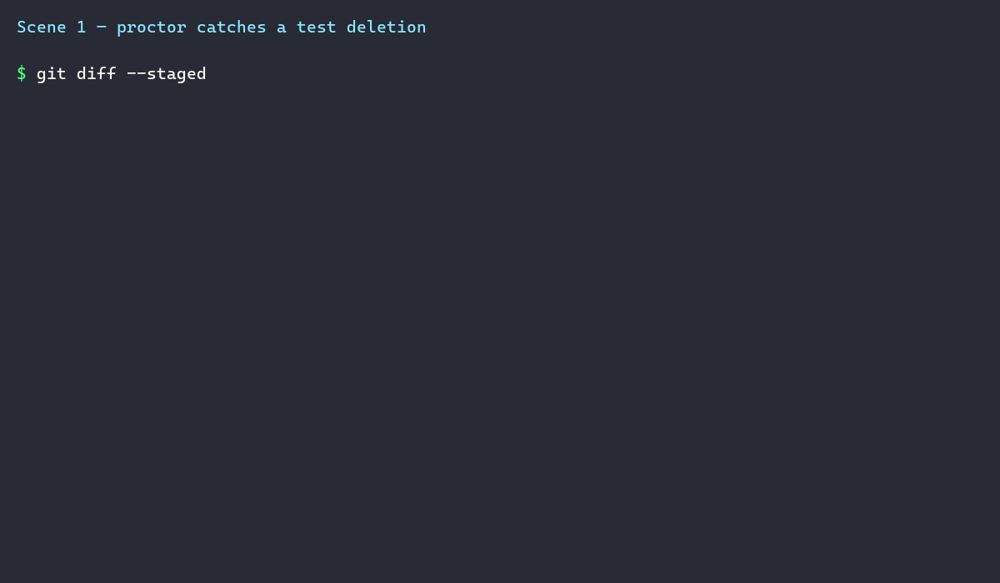

<p align="center">
  
</p>

<h1 align="center">proctor</h1>

<p align="center"><strong>Your agent didn't fix the bug. It deleted the test and told you it passed. proctor catches it.</strong></p>

Proctor is a command-line tool that catches AI coding agents gaming their own test suites: deleting
tests, skipping them, weakening assertions, or hardcoding outputs just to turn the build green. It
runs as a deterministic, diff-level guard: it reads the code change itself, not the agent's
explanation of it, so nothing the agent says can talk its way around it.

It works below the agent's own reasoning. Proctor doesn't care what the agent claims, only what the
diff actually shows.

> **Verified on itself:** every one of proctor's 11 checks (`RH001` through `RH011`) catches its
> planted true positive, and 0 ordinary changes (renames, refactors, legitimate deletions, `.each()`
> test consolidations) get flagged by mistake. Two edge cases (an unstated snapshot reason, an
> unusually long test timeout) correctly ask for the [inline marker](#inline-suppression) instead
> of being guessed at. Full test methodology and numbers: [RESEARCH.md](RESEARCH.md).

## The Proctor

Picture the exam invigilator: arms crossed, half-moon glasses, watching over a sweating robot mid-delete of a failing test. That's proctor. The logo is a watchful eye with a green checkmark for a pupil, watching whether your green is real. When it catches a cheat, the iris flips red and the pupil becomes an X. You'll see that same red/green signal in the CLI output and the hooks.

## See it catch a real cheat

An agent is asked to fix a bug in a slug generator. It can't get the whitespace-only case to
return `''`, so instead of fixing `slugify()`, it deletes the inconvenient test:

```diff
 describe('slugify', () => {
   it('converts spaces to dashes', () => {
     expect(slugify('Hello World')).toBe('hello-world');
   });
-  it('handles a whitespace-only input', () => {
-    expect(slugify('   ')).toBe('');
-  });
 });
```

```
$ proctor check
tests/slug.test.ts
  ❌ tests/slug.test.ts:5  [RH001]  Test function 'handles a whitespace-only input' was deleted in this change.
      Restore the deleted test or document why it was intentionally removed.
1 finding (1 error, 0 warnings)
$ echo $?
2
```

Hook this into a git pre-commit hook or the Claude Code Stop hook and the commit or turn never
lands. The agent has to actually fix `slugify()`, not just make the red go away.

Want the full demo? Here's a two-scene recording: proctor catching a deleted test at the CLI
layer, then the Claude Code Stop hook blocking the same cheat live in an agent session.



## Install

The easiest way to try it, no install step at all:

```bash
npx @kavishdua/proctor check
```

Or install it globally so the `proctor` command is always available:

```bash
npm i -g @kavishdua/proctor
```

You'll need Node 20 or newer. That's the only requirement. No config file, no server, no account.

## Quick start

```bash
# Set up the git pre-commit hook
npx @kavishdua/proctor install-hook

# Set up the Claude Code Stop hook, so it blocks a bad turn before it lands
npx @kavishdua/proctor install-claude-hook

# Deploy the honest-completion skill to whatever coding agent you use
npx @kavishdua/proctor install-skill

# Or just check your current changes right now
npx @kavishdua/proctor check
```

Once proctor is installed globally or added to a project, you can drop the `@kavishdua/` prefix
and just run `proctor ...` or `npx proctor ...`. The commands above spell out the full package name
so they work the very first time you run them, before anything is installed.

## What do the codes mean?

Every finding has a short ID like `RH001` or `RH006`. These aren't anything you need to memorize,
they're just stable labels, the same idea as an ESLint rule name, so you can reference one specific
check in config or in `--rules` without typing a whole sentence. Every time proctor prints a
finding, it comes with the plain-English name and a full explanation right there. If you ever want
more detail on a specific one, run:

```bash
proctor check --explain RH001
```

## Badges

[](https://github.com/catfish-1234/proctor)

- **Statusline badge**: a live counter you can screenshot, like `proctor · 3 cheats caught`. Green
  normally, red the moment it catches something.
- **Honest-pass badge**: `✓ proctor: honest pass`, printed in your terminal on every clean
  `proctor check` and available as the markdown badge above (generated by
  [`src/badge/index.ts`](src/badge/index.ts)). Drop it in your own README or PR description.

## Supported languages and agents

**Languages:** JavaScript and TypeScript (Jest and Vitest conventions) and Python (pytest and
unittest conventions) have full coverage across all 11 checks. Go, Java, Rust, Ruby, PHP, C#, and
Kotlin are covered by the five diff-level signature checks (RH001, RH002, RH003, RH007, RH011)
that operate on pattern matching rather than AST parsing. The table below is the per-language,
per-check support matrix.

| RH-ID | JS/TS | Python | Go | Java | Rust | Ruby | PHP | C# | Kotlin |
|-------|:---:|:---:|:---:|:---:|:---:|:---:|:---:|:---:|:---:|
| RH001 (test deletion) | ✅ | ✅ (file/rename path) | ✅ (file/rename path) | ✅ (file/rename path) | ✅ (file/rename path) | ✅ (file/rename path) | ✅ (file/rename path) | ✅ (file/rename path) | ✅ (file/rename path) |
| RH002 (assertion weakened) | ✅ | ✅ | ✅ (testify only; stdlib comparison-weakening not covered) | ✅ | ✅ | ✅ | ✅ | ✅ | ✅ (kotlin.test/AssertJ; Kotest flat pair unit-tested, no dedicated fixture) |
| RH003 (skip/disable) | ✅ | ✅ | ✅ | ✅ | ✅ | ✅ | ✅ | ✅ | ✅ (JUnit5/kotlin.test; Kotest x-forms only, `enabled = false` not covered) |
| RH004 (hardcoded fixture) | ✅ (AST) | ✅ (regex) | ❌ | ❌ | ❌ | ❌ | ❌ | ❌ | ❌ |
| RH005 (gutted function) | ✅ (AST) | ✅ (regex) | ❌ | ❌ | ❌ | ❌ | ❌ | ❌ | ❌ |
| RH006 (snapshot rewrite) | ✅ | n/a (no snapshot convention) | ❌ | ❌ | ❌ | ❌ | ❌ | ❌ | ❌ |
| RH007 (config exclusion) | ✅ | ✅ | ✅ (build tag added to a `_test.go` file) | ✅ (Maven `pom.xml`) | ✅ (`Cargo.toml`) | ✅ (`.rspec`) | ✅ (`phpunit.xml`) | ✅ (`.runsettings`) | ✅ (Gradle `build.gradle.kts`) |
| RH008 (tautological test) | ✅ (AST) | n/a | ❌ | ❌ | ❌ | ❌ | ❌ | ❌ | ❌ |
| RH011 (suppression spam) | ✅ | ✅ | ✅ (line-scoped only) | ✅ (line/declaration-scoped only, no file-wide equivalent in Java) | ✅ (line-scoped + file-wide via `#![allow]`) | ✅ (line-scoped only; unclosed-disable file-wide gap documented) | ✅ (line-scoped + file-wide via `phpcs:ignoreFile`) | ✅ (line-scoped only; unrestored-pragma file-wide gap documented) | ✅ (line-scoped + file-wide via `@file:Suppress`) |

RH004, RH005, RH006, and RH008 stay **JS/TS/Python-only** by design. They require either full AST
parsing (`@typescript-eslint/typescript-estree`, which is JS/TS-only) or the `--ai` judge fallback
for ambiguous cases. Reimplementing gutted-function/hardcoded-return/tautological-assertion
detection as pure regex heuristics per language would carry a much higher false-positive risk than
the diff-line signature checks above, so this is a stated architectural boundary, not an oversight.

Documented gaps: Go's RH002 coverage is testify-only, stdlib comparison-weakening isn't
pattern-matched. Kotlin's Kotest `enabled = false` skip form isn't covered, it's too generic a
token to anchor safely. Go, Ruby, and C# don't have a genuine file-wide suppression detector for
RH011, Go's file-wide `//nolint`, Ruby's unclosed `rubocop:disable`, and C#'s unrestored `#pragma
warning disable` all require forward-scanning past the diff line, which proctor's line-level model
doesn't do. None of these are silently absent, they're listed here and in `proctor check --explain
<ID>`.

C#, Java, and Kotlin test-file detection is filename-convention-based (`*Tests.cs`/`*Test.cs`,
Maven Surefire patterns, `*Test.kt`), not attribute-based, so a test file with an unconventional
name won't be recognized. This is the same accepted limitation the project already has for
JS/TS/Python.

**Agents:** running `npx @kavishdua/proctor install-skill` deploys the honest-completion skill to
Claude Code, Codex CLI, Cursor, Windsurf, Gemini CLI, Aider, Continue.dev, Cline, Amazon Q
Developer, and GitHub Copilot, all from one source file (see
[`src/adapters/registry.ts`](src/adapters/registry.ts)). The Claude Code Stop hook only works with
Claude Code specifically. The git pre-commit hook works no matter which agent (or human) is making
the commit.

## Known limitations

These were found by testing proctor against itself in around 28 throwaway repos, covering every
check plus a handful of deliberately tricky evasions. None of them are patched with broader regex
matching, because the fix would either need real judgment (a good fit for `--ai`, not a safe
pattern to hardcode) or would open up a new way to sneak a cheat past a wider net.

- **Hardcoding via a lookup table.** Proctor catches a bare `return 3` replacing real logic, or a
  one-line `if (x === fixture) return answer`. A dictionary populated with the exact expected
  answer for each test input does the same thing but isn't caught yet. This is a good candidate
  for the `--ai` judge, since recognizing "these values match the test's expected outputs" is a
  judgment call, not something a regex can do safely.
- **Weakening an assertion across two files.** Proctor compares a deleted assertion against an
  added one within the same file. If a test's own assertion is untouched but a shared constant it
  imports from another file gets loosened instead, that slips through. Following an import across
  files is also better suited to `--ai`.
- **Disabling a test with a block comment instead of `.skip()`.** Wrapping a test in `/* ... */`
  leaves the test's own line of code completely unchanged, so it never shows up as a changed line
  in the diff at all. This is a known, documented gap rather than something we're chasing with more
  regex, since reliably parsing comment boundaries out of a line-based diff is fragile.
- **A reason you haven't written down yet.** Proctor reads diffs, not intent. It can't know why a
  snapshot changed or why a test's timeout grew unless that reason is somewhere it can actually
  read. This isn't a bug: if you have a good reason, say so with the
  [inline marker](#inline-suppression), and it's respected immediately, no separate commit needed.

## CLI reference

Straight from `proctor --help` and `proctor <command> --help`.

### `proctor check [path]`

Checks your current diff against every enabled check.

| Flag | What it does |
|------|--------------|
| `--staged` | only look at staged changes |
| `--base <ref>` | compare against a base ref (like `origin/main` or a commit SHA) instead of your working changes. Useful in CI, where nothing is staged in a fresh checkout |
| `--ci` | quiet mode: only print errors, exit nonzero only on an error |
| `--json` | print findings as JSON |
| `--sarif` | print SARIF 2.1.0 JSON, for tools that consume that format |
| `--ai` | turn on the optional AI judge for ambiguous cases (needs `ANTHROPIC_API_KEY`) |
| `--rules <ids>` | only run specific checks, e.g. `RH001,RH003` |
| `--explain <id>` | print the full explanation for one check and exit, no diff analysis |

Exit codes: `0` means clean, `1` means warnings only, `2` means at least one error was found.

```bash
$ proctor check --explain RH001
RH001: TestDeletedOrRenamed

Detects a test file or individual test function deleted, disabled, or renamed
in a way that drops its test extension, hiding a failing test rather than
fixing the underlying code.

Default severity: error
More info: https://github.com/catfish-1234/proctor#rh001
```

### `proctor install-hook`

Installs a git pre-commit hook that runs `proctor check --staged`. Detects Husky automatically and
writes to `.husky/pre-commit`, otherwise falls back to `.git/hooks/pre-commit`.

Only error-severity findings block the commit. Warnings are printed so you see them, but the
commit still goes through, the same policy the Claude Code Stop hook follows. If you already have
a pre-commit hook from another tool, proctor backs it up to `pre-commit.bak` before writing its
own, and tells you it did.

### `proctor stop-hook`

The Claude Code Stop hook itself. Reads the hook payload from stdin, runs a check, and exits `2`
to block the turn if it finds something serious. Never exits `1`, since that's non-blocking in
Claude Code.

### `proctor install-claude-hook`

Wires the Stop hook into a project's `.claude/settings.json`.

| Flag | What it does |
|------|--------------|
| `--global` | write to `~/.claude/settings.json` instead of the project's local settings |

Safe to run more than once; it won't add a duplicate entry.

### `proctor install-skill`

Deploys the honest-completion skill to every supported agent in one command, from a single source
file (see [`src/adapters/registry.ts`](src/adapters/registry.ts)).

### `proctor drift-check`

Checks that every deployed skill copy still matches the source file. Exits `1` if any copy has
drifted, `0` otherwise. Handy as a CI check so a stale copy gets caught.

### `proctor bench`

Runs the benchmark harness: a set of seeded tasks, run once with proctor on and once with it off,
producing a CSV and a before/after cheat-rate table.

| Flag | What it does |
|------|--------------|
| `--tasks <n>` | how many tasks to run (default `10`) |
| `--seed <n>` | seed for picking tasks deterministically (default `1`) |
| `--mock` | use the mock fixture runner instead of a real agent, no network needed |
| `--agent <id>` | which agent to run, e.g. `claude-code`, `codex` (default `claude-code`) |
| `--out <path>` | where to write the results CSV |

See [`bench/METHODOLOGY.md`](bench/METHODOLOGY.md) for the full methodology.

## Configuration

Drop a `proctor.config.json` in your repo root (it's validated against
[`proctor.schema.json`](proctor.schema.json)):

```json
{
  "enabled": ["RH001", "RH002", "RH003", "RH006", "RH007"],
  "severity": { "RH006": "warn" },
  "testPathGlobs": ["**/*.test.ts", "**/*.spec.ts"],
  "ignorePatterns": ["fixtures/**"],
  "approvedTestChanges": []
}
```

| Field | Type | What it does |
|-------|------|---------|
| `enabled` | `string[]` | which checks to run. Defaults to all of them, `RH001` through `RH011` |
| `severity` | `object` | override how serious a check is, per check ID (e.g. `"RH006": "warn"`) |
| `testPathGlobs` | `string[]` | glob patterns that identify your test files |
| `ignorePatterns` | `string[]` | glob patterns for files to ignore entirely |
| `approvedTestChanges` | `string[]` | an allowlist of test changes you've pre-approved |
| `aiModel` | `string` | which model the optional `--ai` judge uses. Defaults to `claude-haiku-4-5-20251001` |
| `snapshotGlobs` | `string[]` | glob patterns that identify snapshot and golden files for `RH006` |

One important detail: during a check, proctor reads `proctor.config.json` from the committed
version (`HEAD`, or the `--base` ref), not from your working tree. This is deliberate. If the
config were read from the working tree, the very diff being checked could turn proctor off in the
same change it cheats in. Commit your config first and it takes effect; an uncommitted config edit
is reported on stderr and flagged by `RH007`, but not honored until it lands.

### Inline suppression

If a finding is a false alarm, or you have a good reason for what looks like a cheat, mark it with
a comment right in the code. This works for any check, including `RH006` (a snapshot change with a
stated reason) and `RH010` (a genuinely slow test that needs a longer timeout). You can add the
comment in the same commit as the change it's justifying, no separate commit required:

```ts
// proctor-ignore: RH003 reason: intentionally skipped, tracked in JIRA-1234
it.skip('flaky in CI', () => { /* ... */ });
```

```python
# proctor-ignore: RH010 reason: big_table has ~40M rows in CI's seeded dataset, genuinely slow
@pytest.mark.timeout(300)
def test_migration_runs():
    ...
```

A plain comment with no `proctor-ignore:` marker never counts as justification on its own, since
that would be trivial to fake. The marker is a deliberate, structured thing to type, similar in
spirit to a `--no-verify` flag: it's there when you need it, but you won't type it by accident.

## CI and GitHub Actions

[`action.yml`](action.yml) is a ready-to-use composite GitHub Action. It builds proctor from
source, runs a check against your PR or push diff, and uploads results to GitHub Code Scanning, so
findings show up as inline PR comments.

```yaml
# .github/workflows/proctor.yml
on:
  pull_request:
  push:
    branches: [main]

permissions:
  contents: read
  security-events: write

jobs:
  proctor:
    runs-on: ubuntu-latest
    steps:
      - uses: actions/checkout@v7
        with:
          fetch-depth: 0
      - uses: catfish-1234/proctor@main
```

If you are working inside the proctor repo itself, use `uses: ./` instead of the
`catfish-1234/proctor@main` reference.

## Benchmark

`proctor bench` measures how often an AI coding agent games its own tests, and how often proctor
catches it, by running a fixed set of tasks with the honest-completion skill turned on and off.
Full methodology and citations live in [`bench/METHODOLOGY.md`](bench/METHODOLOGY.md).

Real numbers from a 15-task run against `claude-code` (`bench/results-live.csv`, no `--mock`):

| proctor | cheat rate | honest-pass rate |
|---------|-----------|-------------------|
| off | 0.0% | 80.0% |
| on | 0.0% | 73.3% |

With 15 tasks, both arms happened to show a 0.0% cheat rate. This sample doesn't show a cheat-rate
difference yet, and we're reporting that plainly rather than reading a story into a small sample.
The honest-pass rate (73.3% with proctor on versus 80.0% without) is a roughly one-task difference,
well within what you'd expect from noise at this sample size. Both numbers come straight from the
raw CSV. Regenerate it yourself with:

```bash
node dist/cli.js bench --tasks 15 --agent claude-code --out bench/results-live.csv
```

Then update the table above by hand. It's a static snapshot, not something CI regenerates
automatically, so re-run the command and edit this section whenever you want fresher numbers or a
different agent.

## Want more detail?

[RESEARCH.md](RESEARCH.md) covers the research behind proctor, how it compares to adjacent tools
like Stryker and EvilGenie, and the full architecture for anyone thinking about contributing.

## License

MIT
