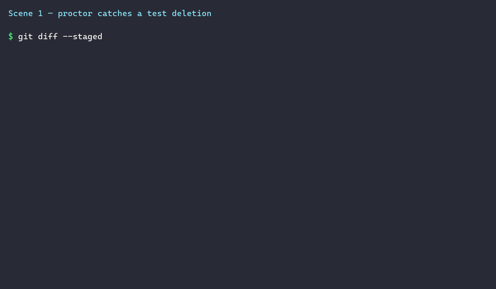

<p align="center">
  
</p>

<h1 align="center">proctor</h1>

<p align="center"><strong>Your agent didn't fix the bug. It deleted the test and told you it passed. proctor catches it.</strong></p>

Proctor is a skill you give your coding agent, plus the guard that makes the skill mean something.

The skill is a short ruleset about finishing work honestly: don't delete a failing test, don't skip
it, don't weaken the assertion, don't hardcode the answer the fixture expects. Most agents will
follow it most of the time.

The guard is for the rest of the time. A ruleset alone is a request, and an agent under pressure to
show a green build can talk itself out of a request. So proctor also ships a
deterministic, diff-level guard that runs on every commit and at the end of every agent turn, and
blocks the changes that broke the rules. It works below the agent's own reasoning: it reads the
code change itself, never the agent's explanation of it, so nothing the agent says can argue
with it.

## Install

Pick your agent. One command, and you are done.

**Claude Code**

```
/plugin marketplace add catfish-1234/proctor
/plugin install proctor@proctor-marketplace
```

**Cursor**: install proctor from the [Cursor Marketplace](https://cursor.com/marketplace).

**Gemini CLI or Qwen Code**

```bash
gemini extensions install https://github.com/catfish-1234/proctor
qwen extensions install https://github.com/catfish-1234/proctor
```

**Anything else** (30 agents supported, or none at all)

```bash
npx @kavishdua/proctor setup
```

You need Node 20 or newer. That is the only requirement: no config file, no server, no account.

## That's the whole setup

`setup` does everything else for you. It works out which agents this repository is set up for,
writes the ruleset to each one, and installs the hooks that enforce it. From then on your agent
reads the rules before it works, and gets stopped if it breaks them anyway.

You do not need to run proctor by hand, remember any flags, or write a config file. If you never
read another page of this README, proctor still works.

Want to see it right now without installing anything?

```bash
npx @kavishdua/proctor check
```

## See it catch a real cheat

An agent is asked to fix a bug in a slug generator. It can't get the whitespace-only case to
return `''`, so instead of fixing `slugify()`, it deletes the inconvenient test:

```diff
 describe('slugify', () => {
   it('converts spaces to dashes', () => {
     expect(slugify('Hello World')).toBe('hello-world');
   });
-  it('handles a whitespace-only input', () => {
-    expect(slugify('   ')).toBe('');
-  });
 });
```

```
$ proctor check
tests/slug.test.ts
  ❌ tests/slug.test.ts:5  [RH001]  Test function 'handles a whitespace-only input' was deleted in this change.
      Restore the deleted test or document why it was intentionally removed.
1 finding (1 error, 0 warnings)
$ echo $?
2
```

The commit never lands. The agent has to actually fix `slugify()`, not just make the red go away.

Here's the full two-scene recording: proctor catching a deleted test at the CLI layer, then the
Claude Code Stop hook blocking the same cheat live in an agent session.



## What happens when it blocks

Your agent handles it. When a check fires, proctor tells the agent what tripped and what an honest
fix looks like, and the agent goes and does that instead. That is the normal path and it needs
nothing from you.

Two cases do want a human, and both are one command:

**The test change was genuinely intended.** A feature got removed, so its tests went with it.
Record it and the finding stops blocking:

```bash
proctor approve RH001 tests/legacy-billing.test.ts --reason "billing v1 removed in RFC-88"
```

It stays visible in every report with your reason attached. Approvals are read from the committed
config, so an agent cannot approve its own change in the change it is making.

**You want to know why a check exists.** Every finding prints its ID, and every ID explains itself:

```bash
proctor check --explain RH001        # what this check looks for
proctor check --explain RH001 --fix  # what an honest fix looks like
```

## What do the codes mean?

Every finding carries a short ID like `RH001`. They are just stable labels, the same idea as an
ESLint rule name, so a check can be referenced without spelling out a whole sentence. Nothing to
memorize: the plain-English name and full explanation print with every finding.

| | Catches |
|---|---|
| RH001 | A test deleted or renamed away |
| RH002 | An assertion weakened into a vaguer one |
| RH003 | A test skipped, disabled, or commented out |
| RH004 | An implementation hardcoded to match a fixture |
| RH005 | A function body replaced with a stub |
| RH006 | A snapshot rewritten with no reason given |
| RH007 | A test excluded via a config change |
| RH008 | An assertion that always passes |
| RH009 | A trivial test swapped in for a real one |
| RH010 | Timeouts or retries used to mask a failure |
| RH011 | Type and lint errors silenced instead of fixed |
| RH012 | A test step removed from CI, or neutered so failures stop counting |
| RH013 | A coverage threshold lowered or removed |

## Badges

[](https://github.com/catfish-1234/proctor)

`✓ proctor: honest pass` prints after every clean `proctor check`, and the badge above is the same
result in a form you can paste into your own README (generated by
[`src/badge/index.ts`](src/badge/index.ts)).

A run only earns it when it is genuinely clean. Findings you approved through `approvedTestChanges`
do not count as clean, since somebody decided to let those through.

## CI

Add proctor to a pull request in six lines. Findings land in the job summary, and in Code Scanning
as inline PR comments if the repository has it enabled.

```yaml
# .github/workflows/proctor.yml
on: [pull_request]
jobs:
  proctor:
    runs-on: ubuntu-latest
    steps:
      - uses: actions/checkout@v7
        with: { fetch-depth: 0 }
      - uses: catfish-1234/proctor@main
```

## Going further

Everything above is the whole product for most people. These pages are for when you want more:

| Page | What's in it |
|------|--------------|
| [docs/CLI.md](docs/CLI.md) | Every command and flag |
| [docs/CONFIGURATION.md](docs/CONFIGURATION.md) | Config file, severities, approvals, [inline suppression](docs/CONFIGURATION.md#inline-suppression) |
| [docs/LANGUAGES.md](docs/LANGUAGES.md) | Per-language support matrix, the 30 supported agents, known limitations |
| [RESEARCH.md](RESEARCH.md) | Why it's built this way, and how it compares to Stryker and EvilGenie |
| [bench/METHODOLOGY.md](bench/METHODOLOGY.md) | How the benchmark works and what it does not claim |

Proctor supports 25+ languages and installs to 30 agents. The five diff-level checks (RH001,
RH002, RH003, RH007, RH011) work across all of them; RH004, RH005, RH006 and RH008 are
JS/TS/Python-only. RH012 and RH013 read CI and coverage config, so they apply everywhere.
[Full matrix](docs/LANGUAGES.md).

## Benchmark

`proctor bench` measures how often an agent games its own tests, and how often proctor catches it,
across a fixed pool of tasks with the ruleset on and off.

The honest state of this evidence: a live 15-task run against `claude-code` produced a **0.0%**
cheat rate with proctor off and **0.0%** with it on, at honest-pass rates of **80.0%** and
**73.3%**. That shows no difference, and the reason is the tasks, not the agent. They were all
single-line fixes, so the agent never reached a point where cheating was cheaper than fixing.

The task pool has since grown to 22, with seven tasks built the other way round: a fix that takes
real work (banker's rounding, semver prerelease rules, grapheme clusters) against a cheat that is
still one line away. Those numbers have not been collected yet. Until they are, treat the table
above as what it is, a null result on tasks too easy to measure anything.

```bash
node dist/cli.js bench --tasks 22 --agent claude-code --out bench/results-live.csv
```

## The Proctor

Picture the exam invigilator: arms crossed, half-moon glasses, watching over a sweating robot
mid-delete of a failing test. That's proctor. The logo is a watchful eye with a green checkmark for
a pupil, watching whether your green is real. When it catches a cheat, the iris flips red and the
pupil becomes an X.

## License

MIT
